title: Git
output: index.html

--

<h1 style="font-size: 72px">
	Git
</h1>
<br />

## Denny Huang
## 2015/4/25

--

### Who am I ?

<br />
<h2 style="font-size: 60px">
  <b>Denny Huang</b>
</h2>

* SITCON 2013, 2014 總召

* <a href="http://about.me/denny0223" target="_blank">About me</a>

--

# Survey

--

# 是否寫過程式？

--

<h1>
小專題/中大型<br />
專案開發經驗
<h1>

--

# 版本控制經驗

--

# Shell 熟悉程度

--

# Git / GitHub
## It&apos;s different

--

<div align="center">
  
</div>
<div align="right">
  <font size="3">
    Source:&nbsp;
	<a href="https://speakerdeck.com/crboy/code-smart-dont-code-hard" target="_blank">Code Smart, Don&apos;t Code hard</a>&nbsp;
	by 畢玉泉(CrBoy)&lt;crboy@crboy.net&gt;
  </font>
</div>

--

<div align="center">
  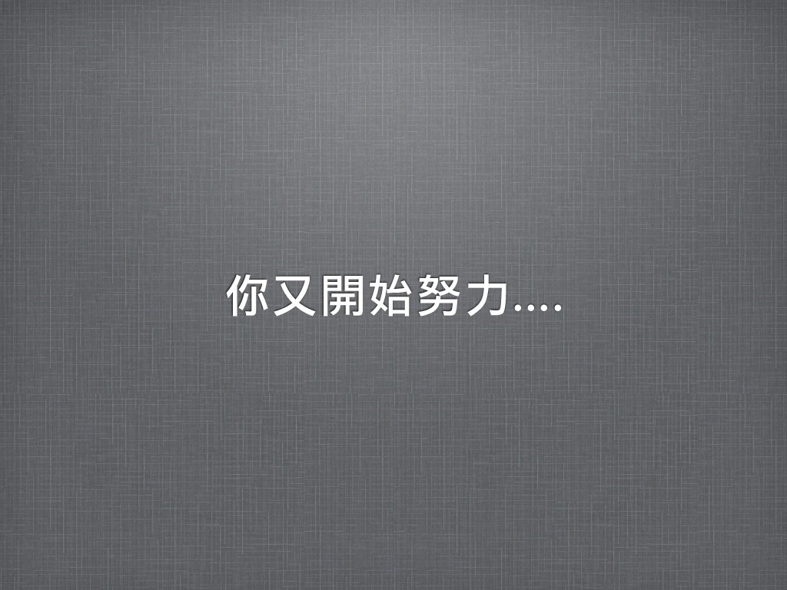
</div>
<div align="right">
  <font size="3">
    Source:&nbsp;
	<a href="https://speakerdeck.com/crboy/code-smart-dont-code-hard" target="_blank">Code Smart, Don&apos;t Code hard</a>&nbsp;
	by 畢玉泉(CrBoy)&lt;crboy@crboy.net&gt;
  </font>
</div>

--

<div align="center">
  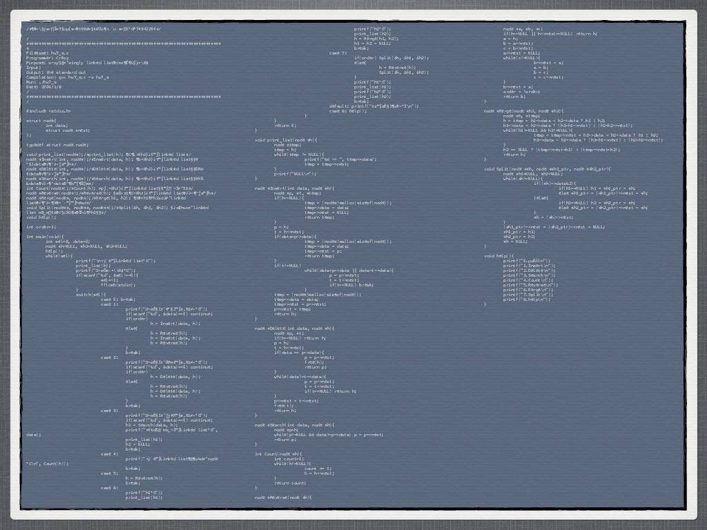
</div>
<div align="right">
  <font size="3">
    Source:&nbsp;
	<a href="https://speakerdeck.com/crboy/code-smart-dont-code-hard" target="_blank">Code Smart, Don&apos;t Code hard</a>&nbsp;
	by 畢玉泉(CrBoy)&lt;crboy@crboy.net&gt;
  </font>
</div>

--

<div align="center">
  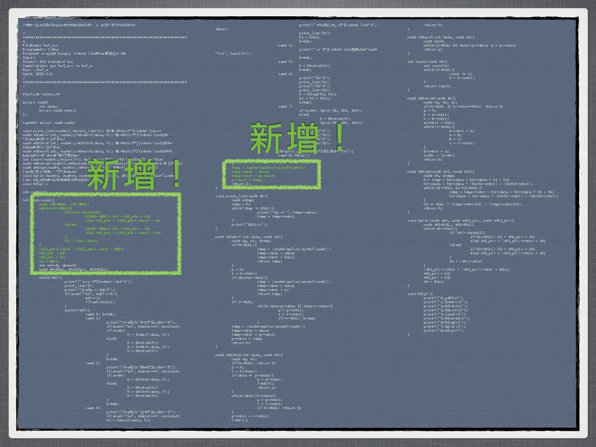
</div>
<div align="right">
  <font size="3">
    Source:&nbsp;
	<a href="https://speakerdeck.com/crboy/code-smart-dont-code-hard" target="_blank">Code Smart, Don&apos;t Code hard</a>&nbsp;
	by 畢玉泉(CrBoy)&lt;crboy@crboy.net&gt;
  </font>
</div>

--

<div align="center">
  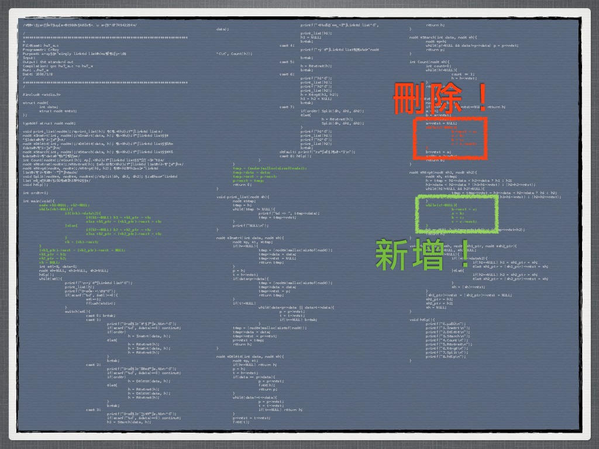
</div>
<div align="right">
  <font size="3">
    Source:&nbsp;
	<a href="https://speakerdeck.com/crboy/code-smart-dont-code-hard" target="_blank">Code Smart, Don&apos;t Code hard</a>&nbsp;
	by 畢玉泉(CrBoy)&lt;crboy@crboy.net&gt;
  </font>
</div>

--

<div align="center">
  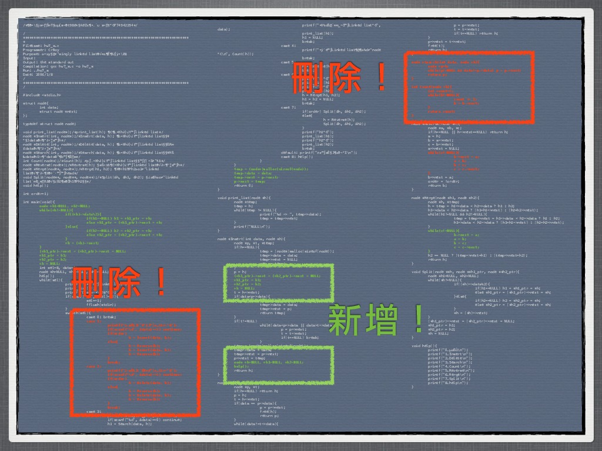
</div>
<div align="right">
  <font size="3">
    Source:&nbsp;
	<a href="https://speakerdeck.com/crboy/code-smart-dont-code-hard" target="_blank">Code Smart, Don&apos;t Code hard</a>&nbsp;
	by 畢玉泉(CrBoy)&lt;crboy@crboy.net&gt;
  </font>
</div>

--

<div align="center">
  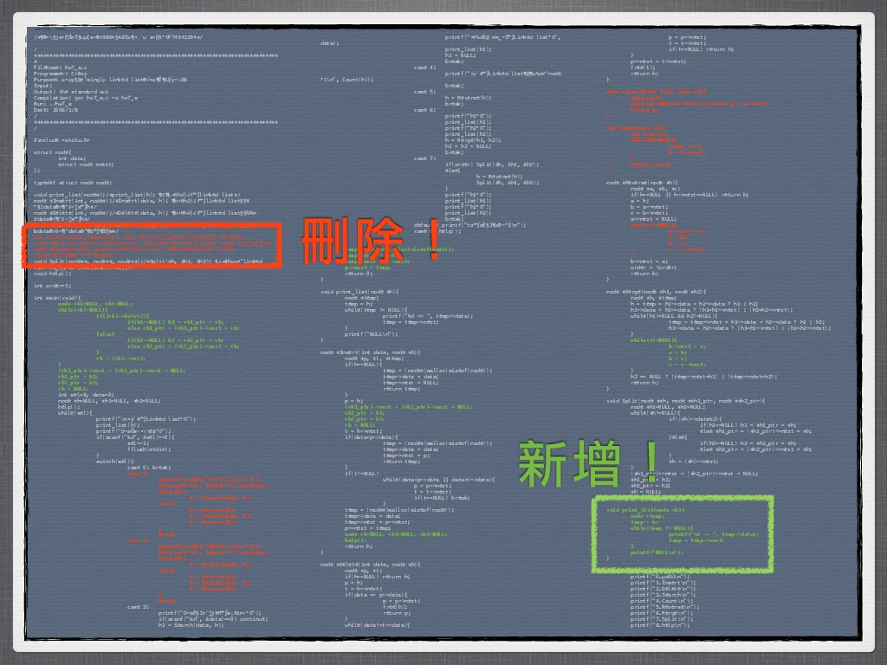
</div>
<div align="right">
  <font size="3">
    Source:&nbsp;
	<a href="https://speakerdeck.com/crboy/code-smart-dont-code-hard" target="_blank">Code Smart, Don&apos;t Code hard</a>&nbsp;
	by 畢玉泉(CrBoy)&lt;crboy@crboy.net&gt;
  </font>
</div>

--

<div align="center">
  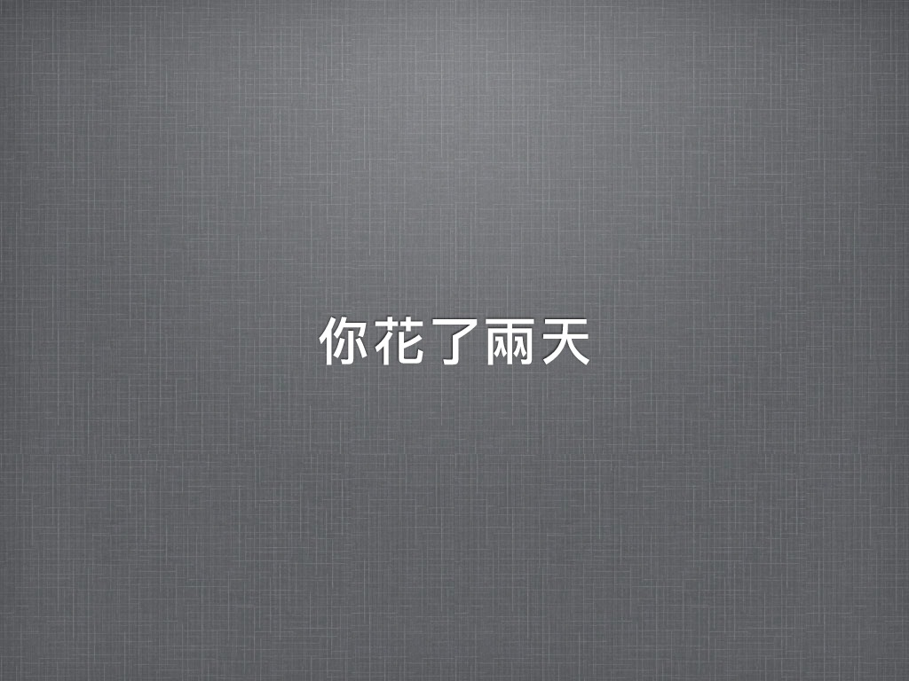
</div>
<div align="right">
  <font size="3">
    Source:&nbsp;
	<a href="https://speakerdeck.com/crboy/code-smart-dont-code-hard" target="_blank">Code Smart, Don&apos;t Code hard</a>&nbsp;
	by 畢玉泉(CrBoy)&lt;crboy@crboy.net&gt;
  </font>
</div>

--

<div align="center">
  
</div>
<div align="right">
  <font size="3">
    Source:&nbsp;
	<a href="https://speakerdeck.com/crboy/code-smart-dont-code-hard" target="_blank">Code Smart, Don&apos;t Code hard</a>&nbsp;
	by 畢玉泉(CrBoy)&lt;crboy@crboy.net&gt;
  </font>
</div>

--

<div align="center">
  
</div>
<div align="right">
  <font size="3">
    Source:&nbsp;
	<a href="https://speakerdeck.com/crboy/code-smart-dont-code-hard" target="_blank">Code Smart, Don&apos;t Code hard</a>&nbsp;
	by 畢玉泉(CrBoy)&lt;crboy@crboy.net&gt;
  </font>
</div>

--

<div align="center">
  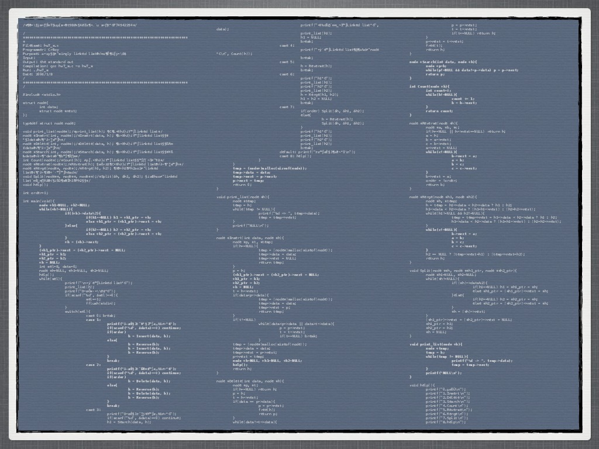
</div>
<div align="right">
  <font size="3">
    Source:&nbsp;
	<a href="https://speakerdeck.com/crboy/code-smart-dont-code-hard" target="_blank">Code Smart, Don&apos;t Code hard</a>&nbsp;
	by 畢玉泉(CrBoy)&lt;crboy@crboy.net&gt;
  </font>
</div>

--

<div align="center">
  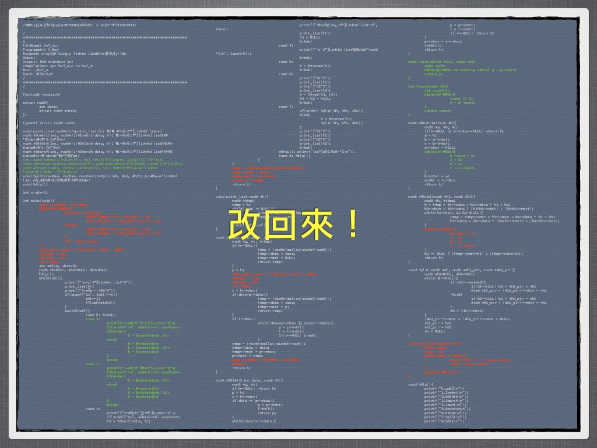
</div>
<div align="right">
  <font size="3">
    Source:&nbsp;
	<a href="https://speakerdeck.com/crboy/code-smart-dont-code-hard" target="_blank">Code Smart, Don&apos;t Code hard</a>&nbsp;
	by 畢玉泉(CrBoy)&lt;crboy@crboy.net&gt;
  </font>
</div>

--

<div align="center">
  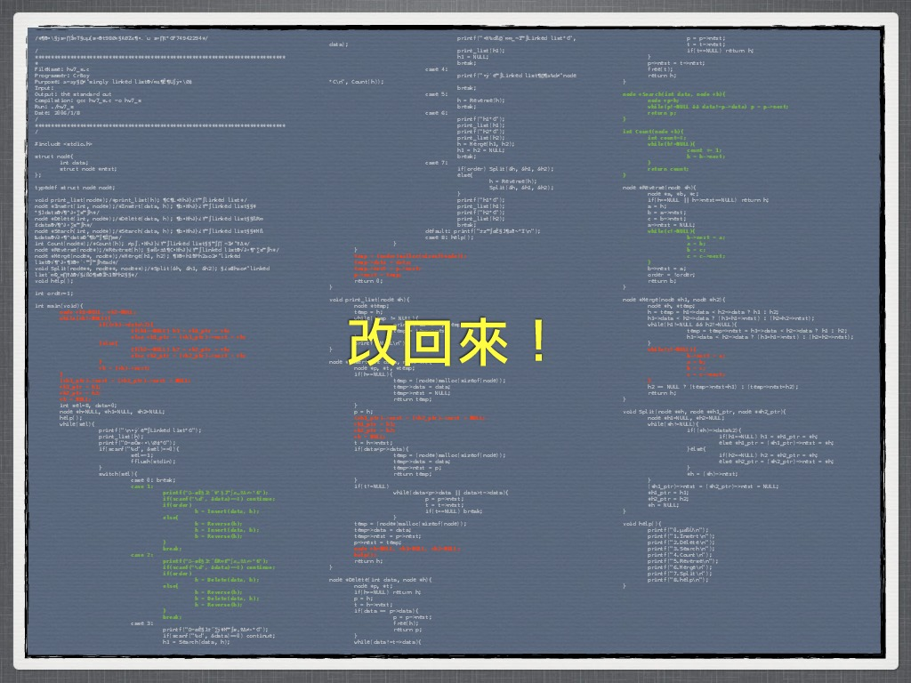
</div>
<div align="right">
  <font size="3">
    Source:&nbsp;
	<a href="https://speakerdeck.com/crboy/code-smart-dont-code-hard" target="_blank">Code Smart, Don&apos;t Code hard</a>&nbsp;
	by 畢玉泉(CrBoy)&lt;crboy@crboy.net&gt;
  </font>
</div>

--

<div align="center">
  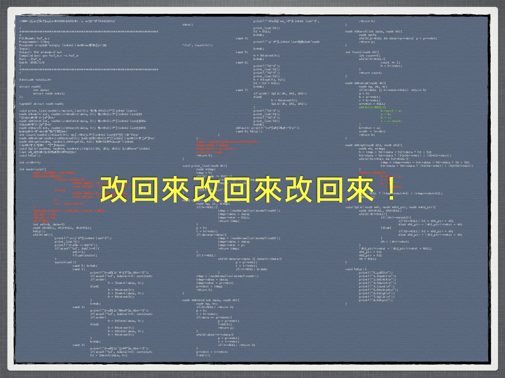
</div>
<div align="right">
  <font size="3">
    Source:&nbsp;
	<a href="https://speakerdeck.com/crboy/code-smart-dont-code-hard" target="_blank">Code Smart, Don&apos;t Code hard</a>&nbsp;
	by 畢玉泉(CrBoy)&lt;crboy@crboy.net&gt;
  </font>
</div>

--

<div align="center">
  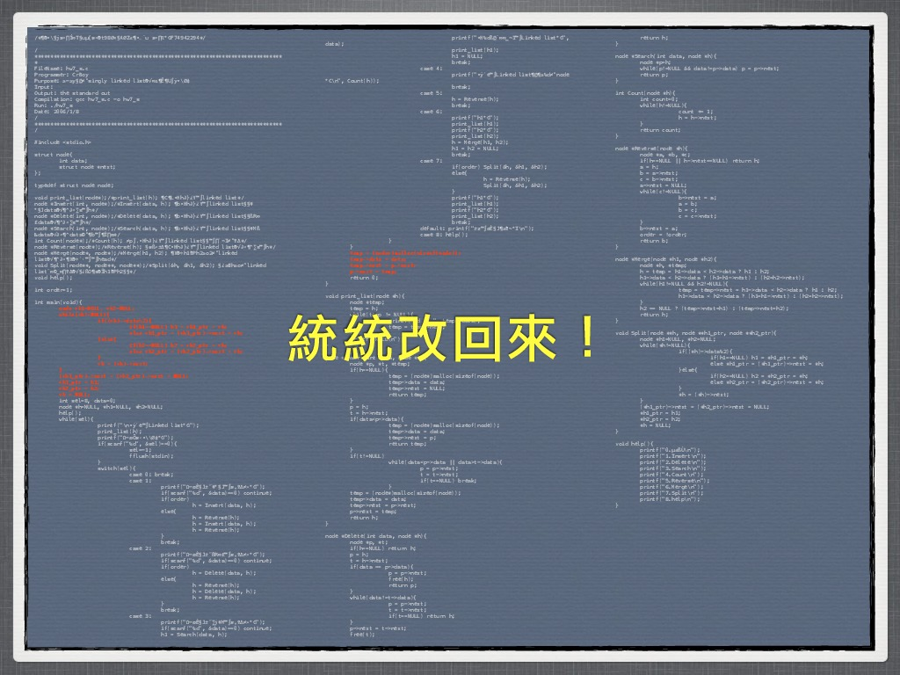
</div>
<div align="right">
  <font size="3">
    Source:&nbsp;
	<a href="https://speakerdeck.com/crboy/code-smart-dont-code-hard" target="_blank">Code Smart, Don&apos;t Code hard</a>&nbsp;
	by 畢玉泉(CrBoy)&lt;crboy@crboy.net&gt;
  </font>
</div>

--

<div align="center">
  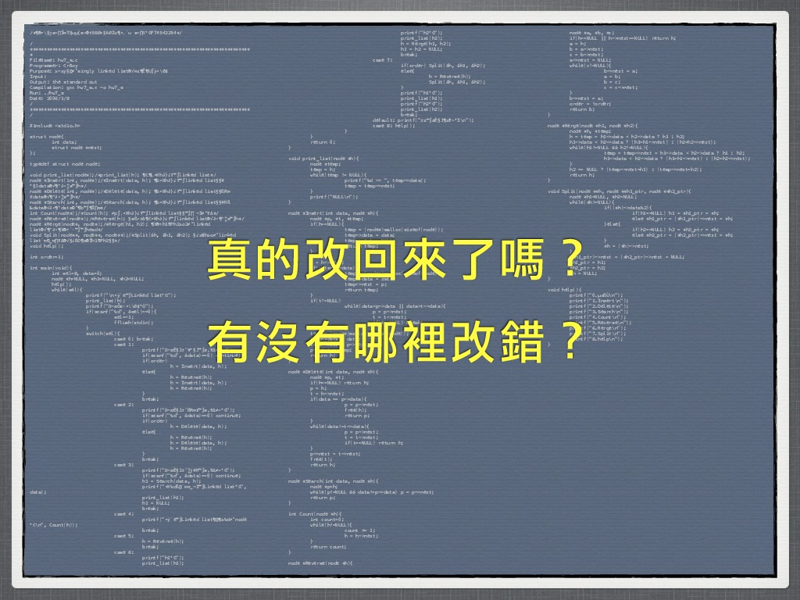
</div>
<div align="right">
  <font size="3">
    Source:&nbsp;
	<a href="https://speakerdeck.com/crboy/code-smart-dont-code-hard" target="_blank">Code Smart, Don&apos;t Code hard</a>&nbsp;
	by 畢玉泉(CrBoy)&lt;crboy@crboy.net&gt;
  </font>
</div>

--

<div align="center">
  
</div>
<div align="right">
  <font size="3">
    Source:&nbsp;
	<a href="https://speakerdeck.com/crboy/code-smart-dont-code-hard" target="_blank">Code Smart, Don&apos;t Code hard</a>&nbsp;
	by 畢玉泉(CrBoy)&lt;crboy@crboy.net&gt;
  </font>
</div>

--

<div align="center">
  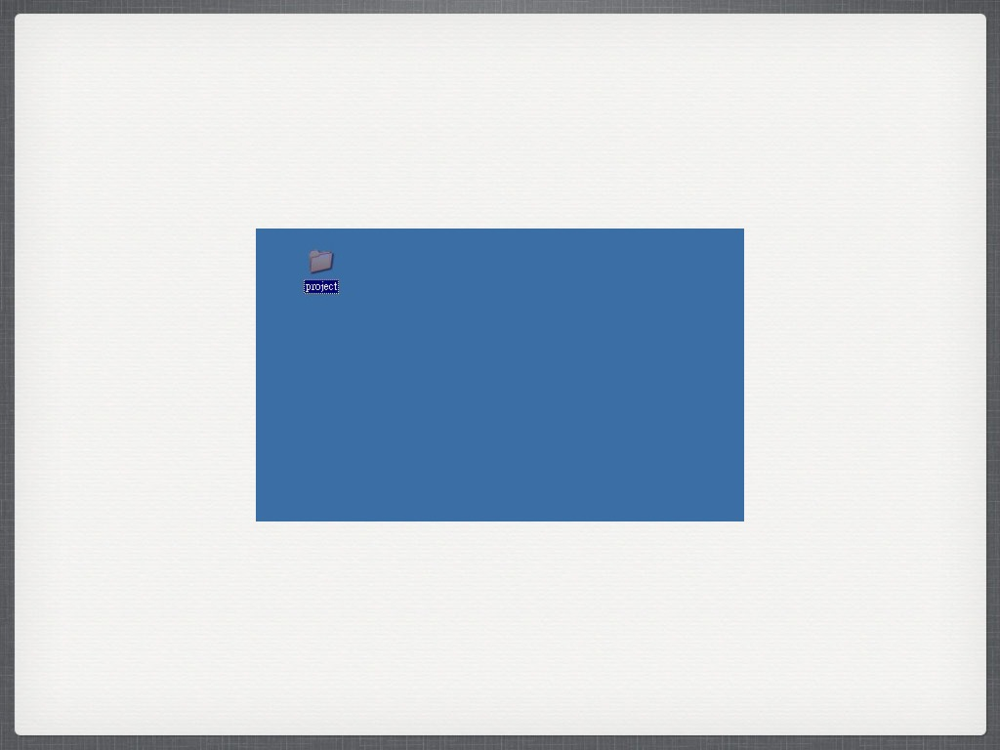
</div>
<div align="right">
  <font size="3">
    Source:&nbsp;
	<a href="https://speakerdeck.com/crboy/code-smart-dont-code-hard" target="_blank">Code Smart, Don&apos;t Code hard</a>&nbsp;
	by 畢玉泉(CrBoy)&lt;crboy@crboy.net&gt;
  </font>
</div>

--

<div align="center">
  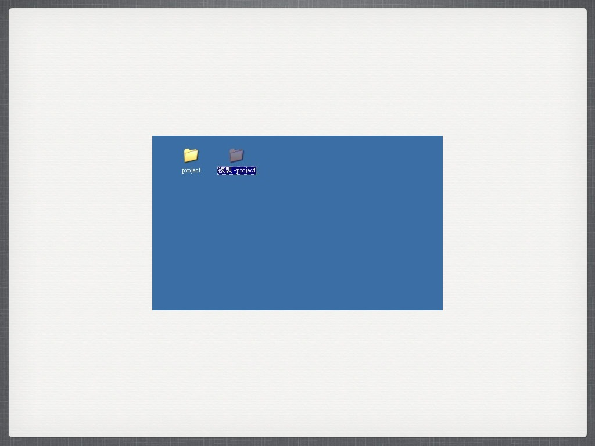
</div>
<div align="right">
  <font size="3">
    Source:&nbsp;
	<a href="https://speakerdeck.com/crboy/code-smart-dont-code-hard" target="_blank">Code Smart, Don&apos;t Code hard</a>&nbsp;
	by 畢玉泉(CrBoy)&lt;crboy@crboy.net&gt;
  </font>
</div>

--

<div align="center">
  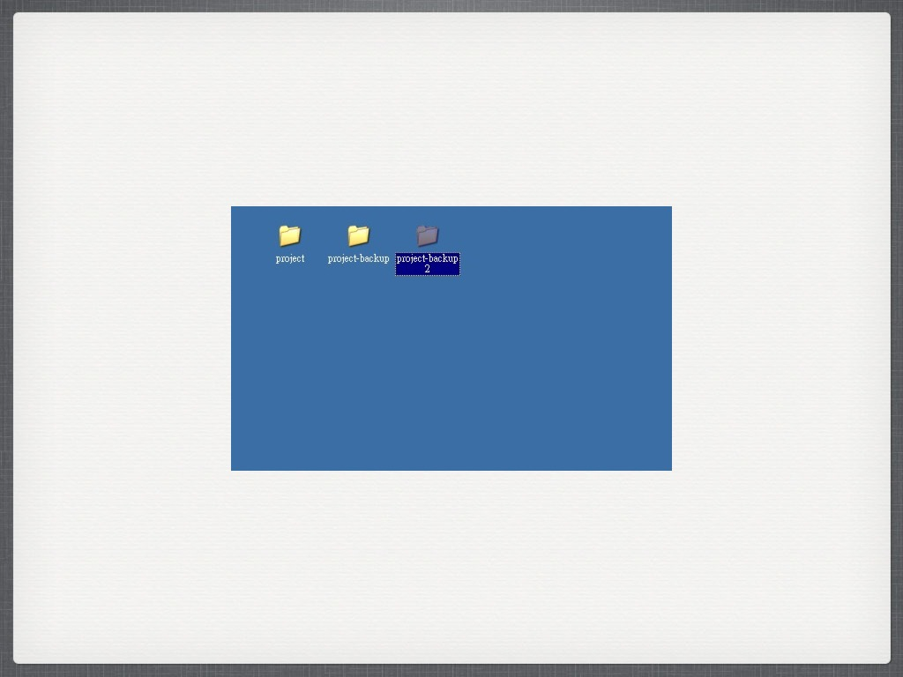
</div>
<div align="right">
  <font size="3">
    Source:&nbsp;
	<a href="https://speakerdeck.com/crboy/code-smart-dont-code-hard" target="_blank">Code Smart, Don&apos;t Code hard</a>&nbsp;
	by 畢玉泉(CrBoy)&lt;crboy@crboy.net&gt;
  </font>
</div>

--

<div align="center">
  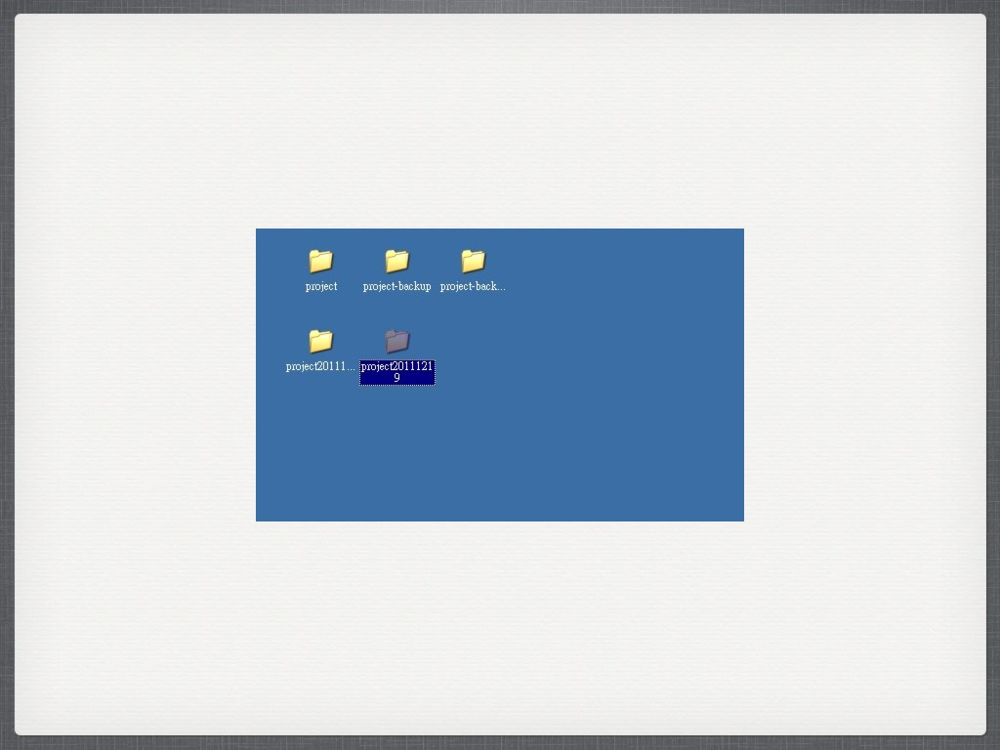
</div>
<div align="right">
  <font size="3">
    Source:&nbsp;
	<a href="https://speakerdeck.com/crboy/code-smart-dont-code-hard" target="_blank">Code Smart, Don&apos;t Code hard</a>&nbsp;
	by 畢玉泉(CrBoy)&lt;crboy@crboy.net&gt;
  </font>
</div>

--

<div align="center">
  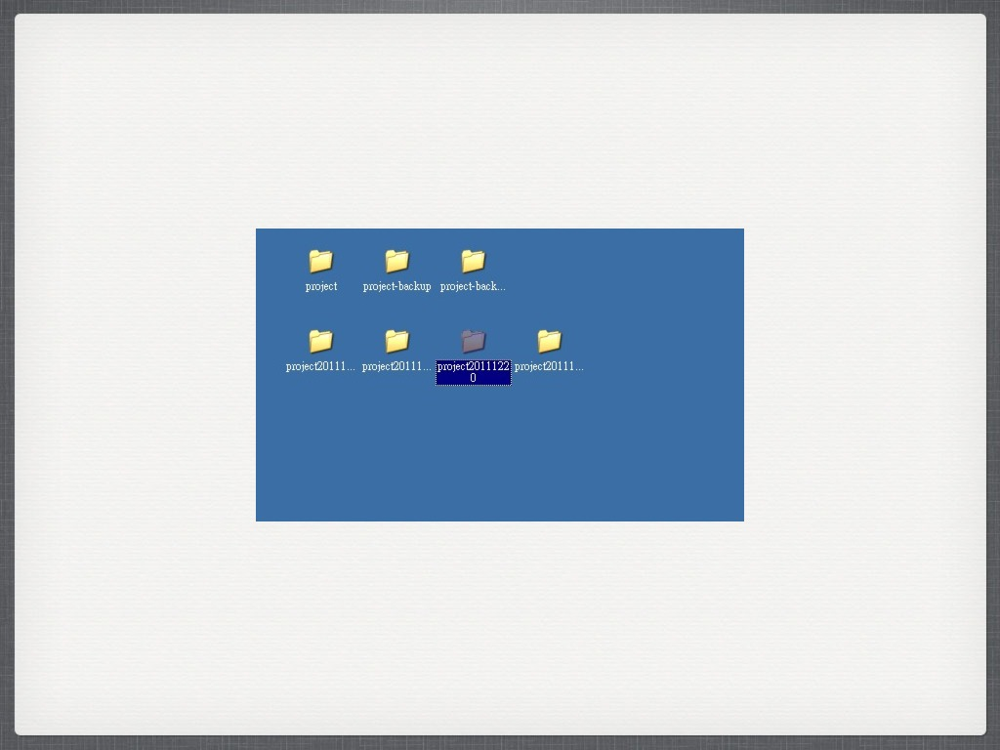
</div>
<div align="right">
  <font size="3">
    Source:&nbsp;
	<a href="https://speakerdeck.com/crboy/code-smart-dont-code-hard" target="_blank">Code Smart, Don&apos;t Code hard</a>&nbsp;
	by 畢玉泉(CrBoy)&lt;crboy@crboy.net&gt;
  </font>
</div>

--

<div align="center">
  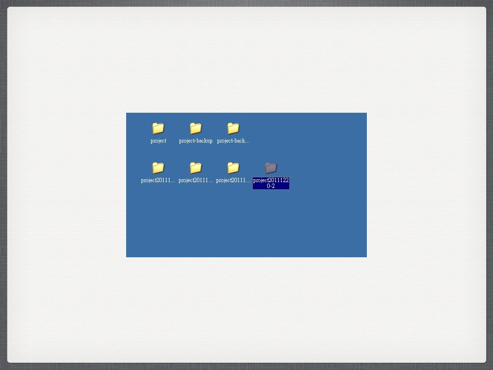
</div>
<div align="right">
  <font size="3">
    Source:&nbsp;
	<a href="https://speakerdeck.com/crboy/code-smart-dont-code-hard" target="_blank">Code Smart, Don&apos;t Code hard</a>&nbsp;
	by 畢玉泉(CrBoy)&lt;crboy@crboy.net&gt;
  </font>
</div>

--

<div align="center">
  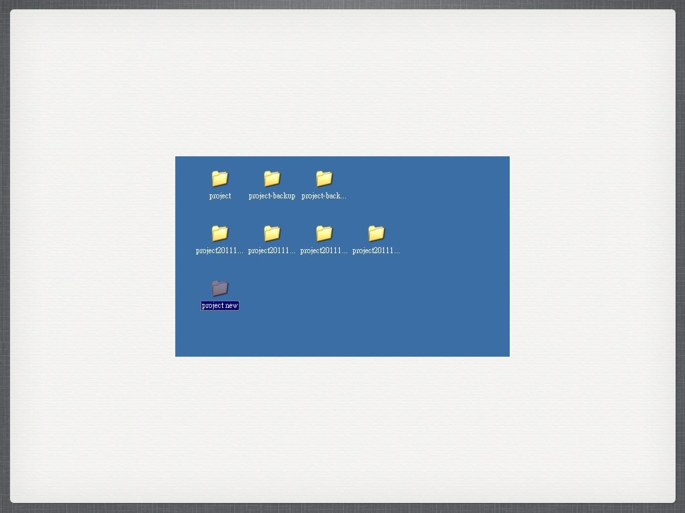
</div>
<div align="right">
  <font size="3">
    Source:&nbsp;
	<a href="https://speakerdeck.com/crboy/code-smart-dont-code-hard" target="_blank">Code Smart, Don&apos;t Code hard</a>&nbsp;
	by 畢玉泉(CrBoy)&lt;crboy@crboy.net&gt;
  </font>
</div>

--

<div align="center">
  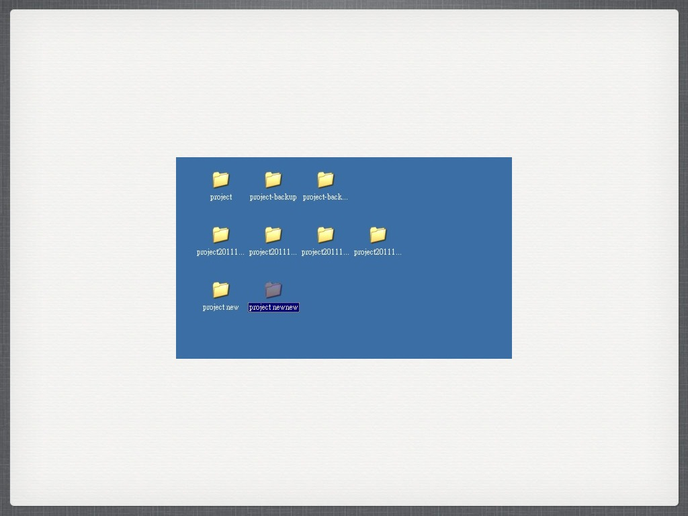
</div>
<div align="right">
  <font size="3">
    Source:&nbsp;
	<a href="https://speakerdeck.com/crboy/code-smart-dont-code-hard" target="_blank">Code Smart, Don&apos;t Code hard</a>&nbsp;
	by 畢玉泉(CrBoy)&lt;crboy@crboy.net&gt;
  </font>
</div>

--

<div align="center">
  
</div>
<div align="right">
  <font size="3">
    Source:&nbsp;
	<a href="https://speakerdeck.com/crboy/code-smart-dont-code-hard" target="_blank">Code Smart, Don&apos;t Code hard</a>&nbsp;
	by 畢玉泉(CrBoy)&lt;crboy@crboy.net&gt;
  </font>
</div>

--

<div align="center">
  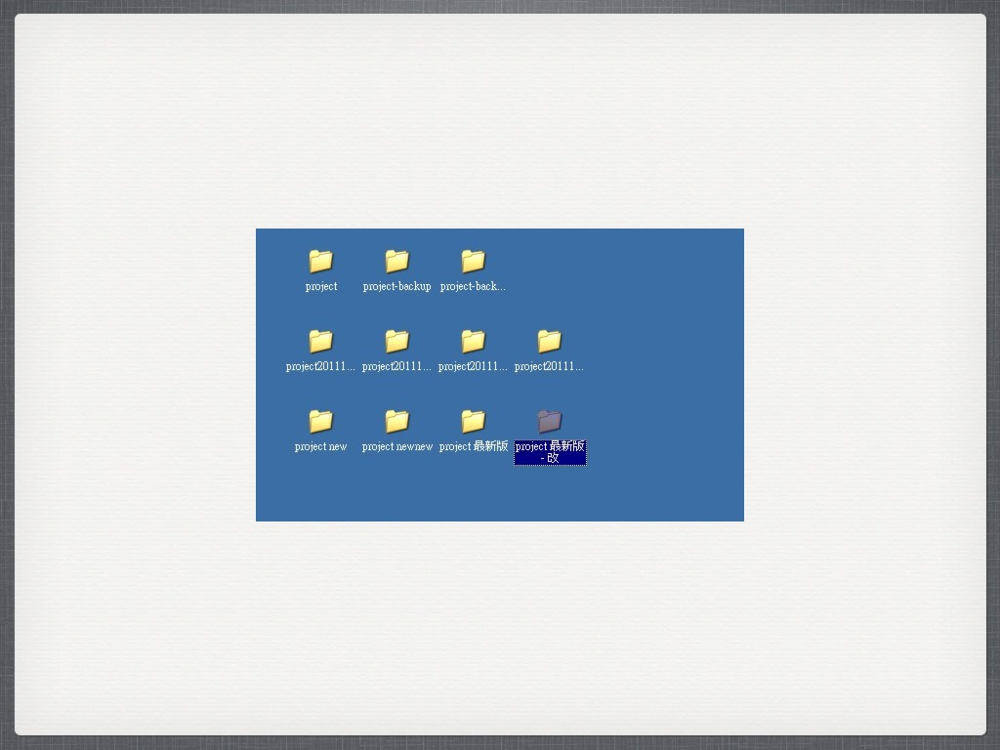
</div>
<div align="right">
  <font size="3">
    Source:&nbsp;
	<a href="https://speakerdeck.com/crboy/code-smart-dont-code-hard" target="_blank">Code Smart, Don&apos;t Code hard</a>&nbsp;
	by 畢玉泉(CrBoy)&lt;crboy@crboy.net&gt;
  </font>
</div>

--

<div align="center">
  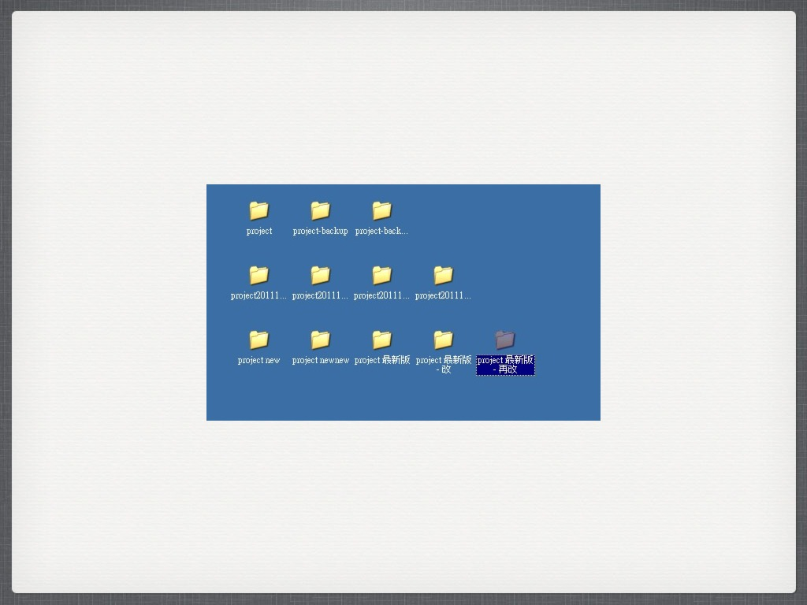
</div>
<div align="right">
  <font size="3">
    Source:&nbsp;
	<a href="https://speakerdeck.com/crboy/code-smart-dont-code-hard" target="_blank">Code Smart, Don&apos;t Code hard</a>&nbsp;
	by 畢玉泉(CrBoy)&lt;crboy@crboy.net&gt;
  </font>
</div>

--

<div align="center">
  
</div>
<div align="right">
  <font size="3">
    Source:&nbsp;
	<a href="https://speakerdeck.com/crboy/code-smart-dont-code-hard" target="_blank">Code Smart, Don&apos;t Code hard</a>&nbsp;
	by 畢玉泉(CrBoy)&lt;crboy@crboy.net&gt;
  </font>
</div>

--

<div align="center">
  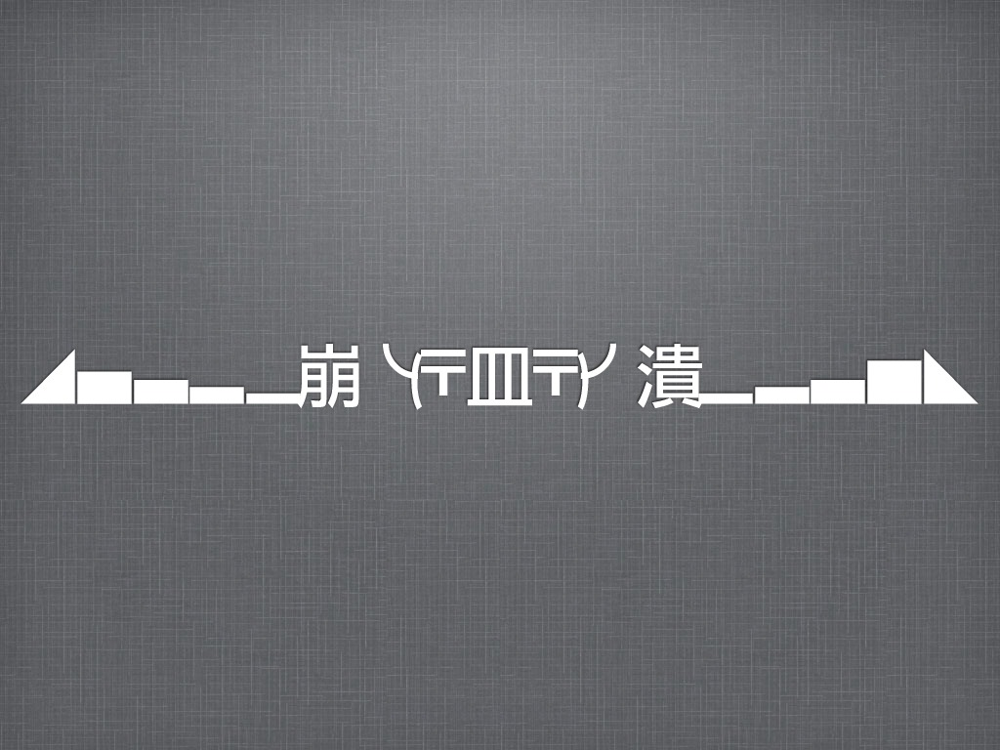
</div>
<div align="right">
  <font size="3">
    Source:&nbsp;
	<a href="https://speakerdeck.com/crboy/code-smart-dont-code-hard" target="_blank">Code Smart, Don&apos;t Code hard</a>&nbsp;
	by 畢玉泉(CrBoy)&lt;crboy@crboy.net&gt;
  </font>
</div>

--

<div align="center">
  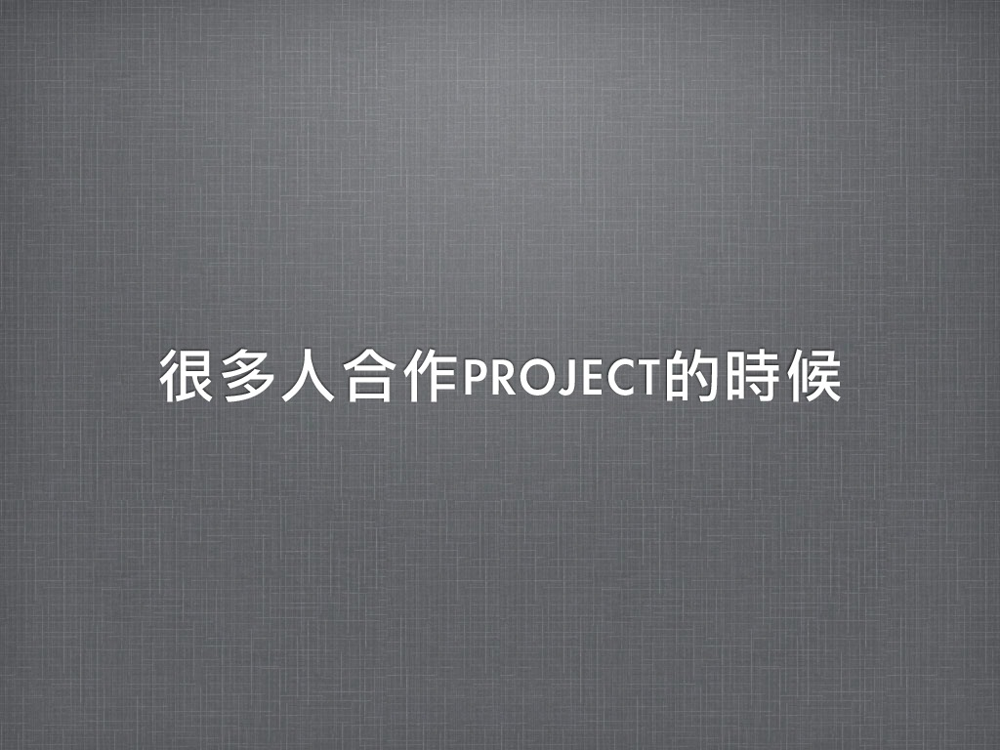
</div>
<div align="right">
  <font size="3">
    Source:&nbsp;
	<a href="https://speakerdeck.com/crboy/code-smart-dont-code-hard" target="_blank">Code Smart, Don&apos;t Code hard</a>&nbsp;
	by 畢玉泉(CrBoy)&lt;crboy@crboy.net&gt;
  </font>
</div>

--

<div align="center">
  
</div>
<div align="right">
  <font size="3">
    Source:&nbsp;
	<a href="https://speakerdeck.com/crboy/code-smart-dont-code-hard" target="_blank">Code Smart, Don&apos;t Code hard</a>&nbsp;
	by 畢玉泉(CrBoy)&lt;crboy@crboy.net&gt;
  </font>
</div>

--

<div align="center">
  
</div>
<div align="right">
  <font size="3">
    Source:&nbsp;
	<a href="https://speakerdeck.com/crboy/code-smart-dont-code-hard" target="_blank">Code Smart, Don&apos;t Code hard</a>&nbsp;
	by 畢玉泉(CrBoy)&lt;crboy@crboy.net&gt;
  </font>
</div>

--

<div align="center">
  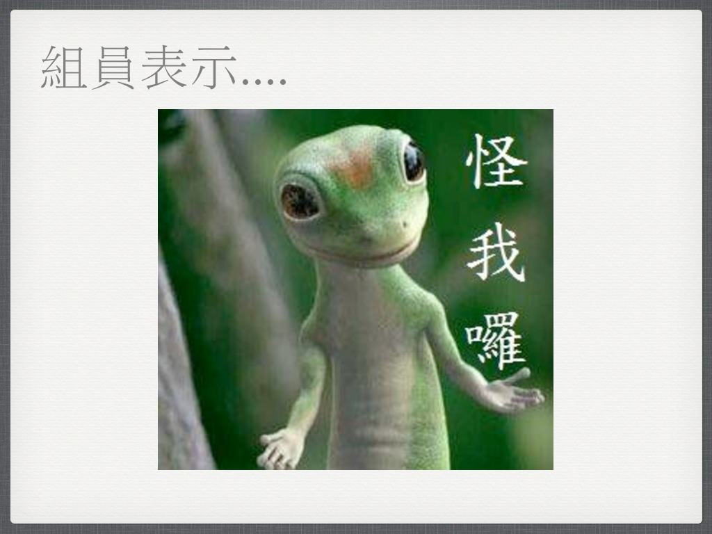
</div>
<div align="right">
  <font size="3">
    Source:&nbsp;
	<a href="https://speakerdeck.com/crboy/code-smart-dont-code-hard" target="_blank">Code Smart, Don&apos;t Code hard</a>&nbsp;
	by 畢玉泉(CrBoy)&lt;crboy@crboy.net&gt;
  </font>
</div>

--

<div align="center">
  
</div>
<div align="right">
  <font size="3">
    Source:&nbsp;
	<a href="https://speakerdeck.com/crboy/code-smart-dont-code-hard" target="_blank">Code Smart, Don&apos;t Code hard</a>&nbsp;
	by 畢玉泉(CrBoy)&lt;crboy@crboy.net&gt;
  </font>
</div>

--

### 攻城屍的救星
# 版本控制

--

# 版本控制類型

--

### 本地端版本控制

<div align="center">
  <br />
  
</div>

--

### 集中式版本控制系統

<div align="center">
  <br />
  
</div>

--

### 分散式版本控制系統

<div align="center">
  
</div>

--

### 事前準備

* 註冊 [GitHub](http://github.com) 帳號
* 確認已安裝 Git
	* 在 Terminal 輸入 `git` 確認
	* `sudo apt-get install git`
	* `sudo yum install git`
* 選擇輔助武器 - 編輯器 (vim, emacs, gedit)

--

### 環境設定

`git config --global user.email "you@example.com"`

`git config --global user.name "Your Name"`

`git config --global color.ui true`

`git config --global core.editor vim`

--

### 環境設定

`git config --global alias.co commit`

`git config --global alias.lg "log --color --graph --all --pretty=format:'%Cred%h%Creset -%C(yellow)%d%Creset %s %Cgreen(%cr) %C(bold blue)<%an>%Creset' --abbrev-commit --"`

--

# .gitconfig
## Why `--global`?

--

# Practice
## Create a new repo on GitHub

--

# Public / Private
<div align="center">
  <a href="https://education.github.com/pack" target="_blank">Student Developer Pack</a>
</div>

--

# README.md
<div align="center">
  <a href="https://github.com/adam-p/markdown-here/wiki/Markdown-Cheatsheet" target="_blank">Markdown Cheatsheet</a>
  <a href="https://guides.github.com/features/mastering-markdown/" target="_blank">Mastering Markdown</a>
</div>

--

# .gitignore
<div align="center">
  <a href="https://github.com/github/gitignore" target="_blank">collection of useful .gitignore templates</a>
</div>

--

# License
<div align="center">
  <a href="http://www.openfoundry.org/tw/licenses" target="_blank">授權條款介紹 - OpenFoundry</a>
</div>

--

# Practice
## Delete the repository

--

# Practice
## Create an new repo without initialization

--

# Practice
## Create a new local repository

--

<h1 style="font-size: 72px">
  <code>git help &lt;command&gt;</code>
</command>

--

# `git init`

--

# Practice
## Add file to staging area

--

<div align="center">
  
</div>
<div align="left">
  <a style="font-size: 25px" href="javascript: jumpPrePage()">back</a>
</div>
<div align="right">
  <font size="4">
	<a href="http://git-scm.com/about/staging-area" target="_blank">圖片來源</a>
  </font>
</div>

--

# `touch README.md`

--

# `git status`

--

### Add file to staging area

* `git add README.md`

* `git add .`

--

# .gitkeep

--

### Unstage file

* `git reset <file>`

<br />
<br />
<br />
<div align="right">
  <a style="font-size: 25px" href="javascript: jumpPage(64)">img</a>
</div>

--

# Practice
## Commit to repository

<div align="right">
  <a style="font-size: 25px" href="javascript: jumpPage(64)">img</a>
</div>

--

### Before commit

* `git status`

* `git diff`

* `git diff --cached`

--

### Commit

* `git commit`

* `git commit -m "first commit"`

--

# 何時該 commit？

--

<h1 style="font-size: 72px">
  commit log 怎麼寫？
</h1>
<div align="center">
  <a style="font-size: 30px" href="./img/yo.png" target="_blank">yo</a>
</div>
<div align="right">
  <a style="font-size: 15px" href="http://www.reddit.com/r/shittyprogramming/comments/1skq3s/my_buddy_is_a_phenomenal_programmer_but_really/" target="_blank">圖片來源</a>
</div>

--

# `git commit -a`

--

<div align="center">
  
</div>
<div align="right">
  <font size="4">
	<a href="http://git-scm.com/about/staging-area" target="_blank">圖片來源</a>
  </font>
</div>

--

# Practice
## Show commit message

--

### Show commit log

* `git log`

* `git show <revisions>`

--

<h1 style="font-size: 60px">
  SPECIFYING REVISIONS
</h1>
<div align="center">
  <a href="https://www.kernel.org/pub/software/scm/git/docs/gitrevisions.html" target="_blank">gitrevisions(7) Manual Page</a>
</div>

--

# Practice
## Untrack / Rename file

--

### Remove file

* `git rm <file>`

### Untrack file

* `git rm --cached <file>`

--

### Rename file

* `git mv <file>`

--

# Practice
## Back to the past

--

### Checkout to previous version

* `git checkout <revision>`

### Checkout file from previous version

* `git checkout <revision> <file>`

--

### Stash files

* `git stash`

* `git stash save "message"`

* `git stash list`

* `git stash pop`

* `git stash show -p <revision>`

--

### Reset to previous version

* `git reset <revision>`

* `git reset --hard <revision>`

--

### Revert commit

* `git revert <revision>`

--

# Practice
## Push to remote server

--

### Add remote repo

* `git remote add origin https://github.com/denny0223/workshop.git`

* `git remote`

* `git remote -v`

* `git remote show origin`

--

<div align="center">
  
</div>
<div align="right">
  <font size="4">
	<a href="http://zoomq.qiniudn.com/ZQScrapBook/ZqFLOSS/data/20081210180347/" target="_blank">圖片來源</a>
  </font>
</div>

--

### Push to remote repo

* `git push -u origin master`

* `git push origin master`

* `git push`

* <a href="http://stackoverflow.com/a/13148313" target="_blank">push.default</a>

--

### List branches

* `git branch`

* `git branch -a`

* `git branch -v`

* `git branch -vv`

--

### Cache https password

`git config --global credential.helper cache`

`git config --global credential.helper "cache --timeout=3600"`

<br />
<div align="right">
<a href="http://stackoverflow.com/questions/5343068/is-there-a-way-to-skip-password-typing-when-using-https-github/5343146#5343146">more</a>
</div>

--

# Practice
## Clone your repo via ssh
## try to commit and push

--

# `git clone`

--

<br /><br /><br />
## Please make sure you have the correct access rights
## and the repository exists.

--

<h1 style="font-size: 75px">
  <a href="https://help.github.com/articles/generating-ssh-keys" target="_blank">Generating SSH keys</a>
</h1>

--

# Practice
## Pull from remote repo
## Resolving conflict

--

<h1 style="font-size: 36px">
  Add a new commit at remote via https repo.
</h1>

--

# `git pull`
## `git fetch` + `git merge`

--

# Merge conflict
## `git mergetool`

--

<h1 style="font-size: 72px">
  <code>git pull --rebase</code>
</h1>

--

# Branch

--

<div align="center">
  
</div>

--

# Practice
## Create a branch

--

### Create a branch

* `git branch <branch name>`

* `git checkout -b <branch name>`

--

# Practice
## commit and push new branch to remote

--

### Push when local and remote branch name difference

* `git push <remote> <local_branch_name>:<remote_branch_name>`

--

# Git Flow
<h2>
  <a href="http://nvie.com/posts/a-successful-git-branching-model/" target="_blank">A successful Git branching model</a>
</h2>

--

<div align="center">
  
</div>

--

# Practice
## merge branches

--

### Merge

* `git merge`

* `git merge --no-ff`

--

### Cherry-pick

* `git cherry-pick <revision>`

--

### How Git works?

`inotifywait -rm --format '%w%f %e' -e create -e close_write .`

`git init`

`echo test > file`

`git add file`

--

### 9daeafb9864cf43055ae93beb0afd6c7d144bfa4

* SHA1 of "blob 5␀test␊"

* `printf "blob 5\000test\n" | xxd`

* `printf "blob 5\000test\n" | shasum`

* `echo test | git hash-object --stdin`

* `git cat-file -p 9daeafb9864cf43055ae93beb0afd6c7d144bfa4`

--

* `cd .git/objects/9d/`

``` python
[denny@X230 9d]$ python
Python 2.7.5 (default, Nov  3 2014, 14:26:24)
[GCC 4.8.3 20140911 (Red Hat 4.8.3-7)] on linux2
Type "help", "copyright", "credits" or "license" for more information.
>>> fd = open("aeafb9864cf43055ae93beb0afd6c7d144bfa4", "rb")
>>> line = fd.read()
>>> import zlib
>>> zlib.decompress(line)
'blob 5\x00test\n'
```

--

### cat-file -p &lt;revision&gt;

`git cat-file -p 8b9af3b`


```
tree 993624220e92bb14b1703b6005dccfda913e95bc
parent a5d55500219b63ac21bb3977ae1a69bf5f1f793f
author Denny Huang <denny0223@gmail.com> 1407702807 +0800
committer Denny Huang <denny0223@gmail.com> 1407702807 +0800

update
```
--

### Patch commit

* `git add --patch`

* `git commit --patch`

--

# Practice
## Modify you commit

--

### Modify commit history

`git commit --amend`

`git commit --amend --date="Mar 15 00:00 2014"`

`git rebase -i <revision>`

--

### Useful skill

* `git reflog`

--

# Practice
## Trace log

--

### More about diff

* `git diff <revision>`

* `git diff master@{2014-07-01}`

* `git diff master@{"1 month ago"}`

--

### More about git log

* `git log -p --stat`

* `git log --oneline`

* `git log --graph`

* `git log --abbrev-commit`

* `git log --pretty=%an`

* `git whatchanged`

--

### Limit

* `git log --author="Denny Huang"`

* `git log --since={2014-07-01} --until="1 week ago"`

### search by regex

* `git log -p -i -G 'regex'`

--

### Who wrote this code?

* `git blame <filepath>`

--

### Hosting a Git server

* bare repo

* <a href="http://gogs.io/" target="_blank">Gogs</a>

* <a href="https://about.gitlab.com/" target="_blank">GitLab</a>

--

### Create a bare repo

* `git init --bare`

* `git clone ///path/to/repo`

* `git clone ssh://[username]@[host]:[port]/path/to/repo`

--

### Add hooks

* `.git/hooks/`

* `git help githooks`

* <a href="http://git-scm.com/book/en/Customizing-Git-Git-Hooks" target="_blank">more</a>

--

# Issue tracking system

--

# Continuous Integration (CI)

--

<h1 style="font-size: 68px">
  剩下就是你們的事了
</h1>

--

### Something useful

* <a href="http://pages.github.com/" target="_blank">GitHub Pages</a>

* <a href="https://github.com/k4rthik/git-cal" target="_blank">git-cal</a>

* <a href="http://pcottle.github.io/learnGitBranching/" target="_blank">Learn Git Branching</a>

--

### Something useful (cnt.

* <a href="https://guides.github.com/" target="_blank">GitHub Guides</a>

* <a href="https://github.com/jlord/git-it/blob/master/README-zhtw.md" target="_blank">Git-it</a>

* <a href="http://onlywei.github.io/explain-git-with-d3/" target="_blank">Visualizing Git Concepts with D3</a>

### Just for fun

* <a href="https://github.com/gelstudios/gitfiti" target="_blank">gitfiti</a>

--

### Show branch names in $PS1

<a href="http://xta.github.io/HalloweenBash/" target="_blank">Halloween Bash Profile Generator</a>

<code>
function parse\_git\_branch {<br />
&nbsp;&nbsp; git branch --no-color 2&gt; /dev/null | sed -e '/^[^\*]/d' -e 's/* \(.*\)/(\1)/' <br />
}<br />
</code>

`export PS1="\h:\W \u\$(parse_git_branch)$ "`

--

### Resources

* <a href="http://git-scm.com/book" target="_blank">Pro Git</a>

* <a href="http://git-scm.com/book/zh-tw" target="_blank">Pro Git (zh-tw)</a>

* <a href="http://ihower.tw/git/" target="_blank">版本控制系統 Git 精要</a>

* <a href="http://www-cs-students.stanford.edu/~blynn/gitmagic/intl/zh_tw/" target="_blank">Git Magic</a>

--

### Resources (cnt.

* <a href="http://backlogtool.com/git-guide/en/" target="_blank">Git Beginner&#39;s Guide for Dummies</a>

* <a href="http://backlogtool.com/git-guide//tw/" target="_blank">連猴子都能懂的Git入門〜掌握版本控制〜</a>

--

## 10 year

* <a href="https://www.atlassian.com/git/articles/10-years-of-git/" target="_blank">10 Years of Git</a>

* <a href="http://ithome.com.tw/news/95088" target="_blank">Git 十歲了！Git 之父 Linus Torvalds 說古，大談 Git 的起源</a>

--

<h1 style="font-size: 72px">
  Thanks for listening!
</h1>

<br /><br /><br />
<div align="center">
  
</div>
<h2 style="font-size: 18px">
本投影片採用<a href="http://creativecommons.org/licenses/by-sa/3.0/tw/" target="_blank">創用 CC「姓名標示—相同方式分享 3.0 台灣」授權條款</a>
</h2>

